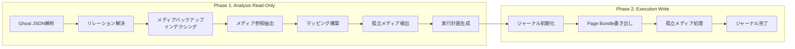
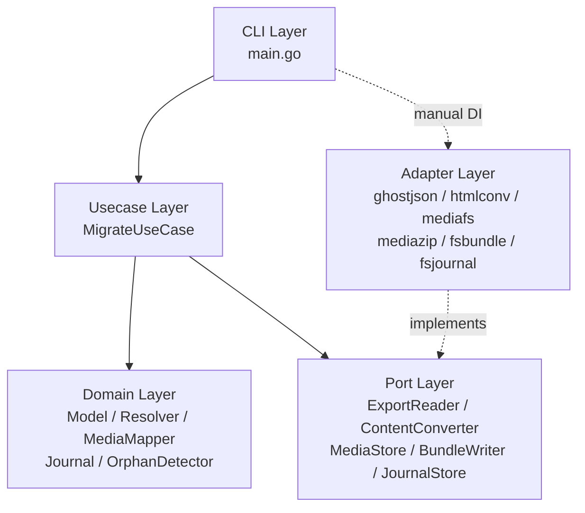
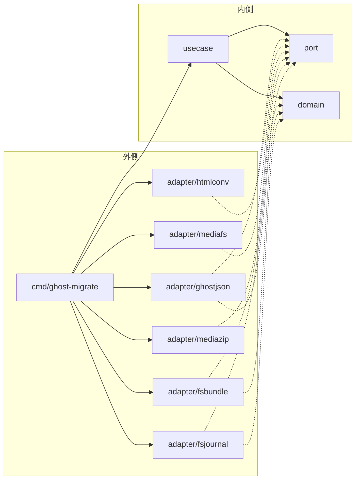
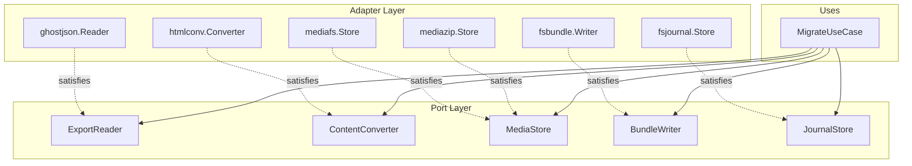
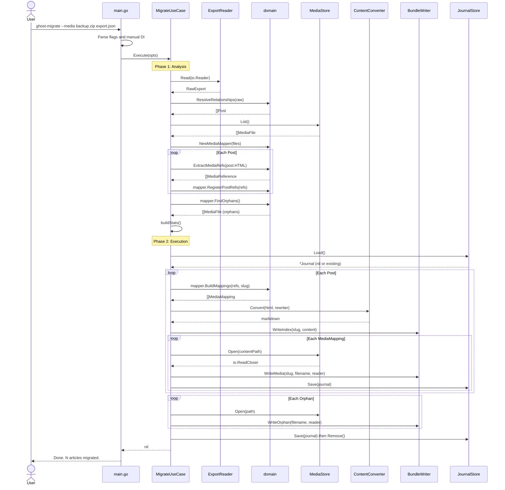
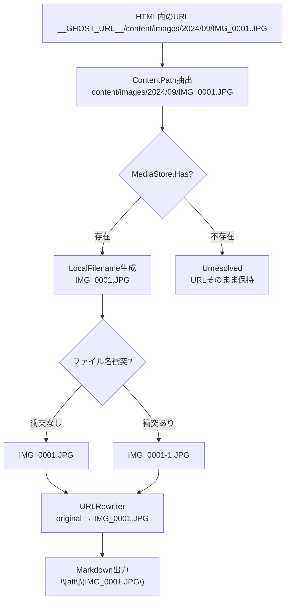
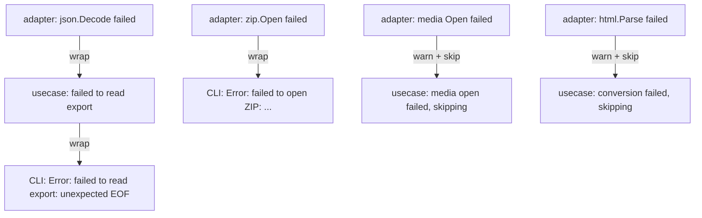

# ghost-migrate 技術設計書

📋

**文書情報**

*プロジェクト名:* ghost-migrate

*バージョン:* 1.0.0

*著者:* 坂下 康信

*最終更新:* 2026-03-07

*ステータス:* Final

## 1. 概要

**ghost-migrate** は、Ghost CMSからの完全な移行を実現するコマンドラインツールである。Ghost管理画面からエクスポートされるJSONファイルを解析してMarkdownファイルに変換するとともに、Ghost Supportから提供されるメディアバックアップ（ZIP / ディレクトリ）内の画像・動画・ファイルを記事単位で整理し、Hugo Page Bundle互換のディレクトリ構造として出力する。

先行プロジェクト ghost-to-md が JSON→Markdown変換に特化していたのに対し、本プロジェクトはメディアファイルの解決・再配置まで含めた「Ghost→SSG完全移行」をシングルバイナリで実現する。

**設計目標**

- ゼロ設定で実用可能なデフォルト動作
- Go標準ライブラリを最大限活用し、外部依存を最小化
- クリーンアーキテクチャ（Ports & Adapters）によるドメインロジックの完全な隔離
- 大容量メディアバックアップ（20GB超）を安全に処理するジャーナルベースのファイル操作
- シングルバイナリによるクロスプラットフォーム配布
- メディア未指定時は ghost-to-md 互換のフラットMarkdown出力にフォールバック

---

## 2. 背景と課題

### 2.1 ghost-to-md の限界

ghost-to-md は Ghost JSON エクスポートから Markdown ファイルを生成するツールとして設計された。しかし制約事項として「画像ファイルのダウンロードは行わない（URLを保持するのみ）」を明記しており、出力される Markdown には Ghost サーバー上の URL がそのまま残される。Ghost サーバーを停止した後、これらの URL は全てリンク切れとなる。記事テキストは救出できても、画像を含むメディアは失われる。

### 2.2 Ghost メディアバックアップの実態

Ghost には GUI 上のメディアエクスポート機能が存在しない。ユーザーが Ghost Support へ連絡することで、S3上のメディアバックアップが ZIP ファイルとして提供される。

この ZIP の内部構造は以下の通りである。

```
my-blog_1753264657/
└── content/
    ├── images/
    │   ├── 2024/
    │   │   ├── 09/
    │   │   │   ├── IMG_0001.JPG
    │   │   │   └── IMG_0002.JPG
    │   │   └── 10/
    │   │       └── photo.jpg
    │   └── 2025/
    │       └── ...
    ├── media/
    │   └── ...
    └── files/
        └── ...
```

このディレクトリ構造には以下の問題がある。

- **日付ベースの分類が無意味**: `2024/09/` 等のディレクトリは Ghost へのアップロード日付を示すのみで、記事の公開日や内容とは無関係である
- **メディア管理システムの不在**: Ghost にはメディアライブラリが存在しない。どの記事からも参照されていない孤立ファイルが存在する
- **ファイル名の衝突回避**: 同名ファイルのアップロード時、Ghost は末尾に `(1)` 等のサフィックスを付与する。一方、同一ファイルに対して複数の記事からリンクを張ることも可能であり、共有メディアが存在する

### 2.3 解決方針

ghost-migrate は以下を一気通貫で実行する。

1. Ghost JSON の完全解析（ghost-to-md と同等）
2. メディアバックアップのインデクシング（ZIP / ディレクトリ両対応）
3. 記事 HTML 内のメディア URL 抽出とバックアップファイルへのマッピング
4. HTML→Markdown 変換時の URL 書き換え（絶対 URL→相対パス）
5. Hugo Page Bundle 形式での出力（記事 + メディアの自己完結ディレクトリ）
6. 孤立メディアの検出と分離
7. ジャーナルベースの安全なファイル操作（中断からの再開可能）

---

## 3. ghost-to-md との関係

### 3.1 プロジェクト分離の判断

ghost-to-md と ghost-migrate は別リポジトリの独立プロジェクトとする。

**分離の根拠**

- **ユースケースの違い**: ghost-to-md は「Markdown 変換だけ」を求めるユーザー向けである。ghost-migrate は「メディアを含む完全移行」を求めるユーザー向けである。両者は同一ユーザーである必要はない
- **依存関係の独立性**: ghost-to-md を Go パッケージとして公開すると `internal/` を `pkg/` に昇格させる必要があり、API 安定性の保証義務が生じる。小規模 CLI ツールには過剰である
- **バイナリの自己完結性**: ユーザーは1バイナリをダウンロードするだけで全機能を利用できるべきである

### 3.2 コード再利用戦略

ghost-to-md のドメイン層・アダプター層のコードを ghost-migrate に複製し、メディア関連の拡張を加える。

**複製対象**

- `domain/model.go` (Post, Tag, Author, Article)
- `domain/resolver.go` (RelationshipResolver)
- `domain/frontmatter.go` (FrontMatter 生成)
- `domain/naming.go` (NamingStrategy)
- `adapter/ghostjson/` (Ghost JSON パーサー全体)
- `adapter/htmlconv/` (HTML→Markdown コンバーター全体)

**ghost-migrate 側での拡張**

- `domain/`: MediaReference, MediaMapping, PageBundle, Journal モデルの追加
- `adapter/htmlconv/`: URLRewriter コールバックの追加
- `adapter/mediafs/`, `adapter/mediazip/`: メディアバックアップ読み取りの新規実装
- `adapter/fsbundle/`: Page Bundle 書き出しの新規実装
- `adapter/fsjournal/`: ジャーナル永続化の新規実装
- `usecase/`: 二相実行モデルの新規設計

---

## 4. 要件定義

### 4.1 機能要件

**Ghost JSON 処理（ghost-to-md から継承）**

- **FR-01** Ghost 管理画面からエクスポートされた JSON ファイル（v4 / v5 / v6 形式）を解析する
- **FR-02** 投稿（post）と固定ページ（page）の両方を抽出する
- **FR-03** HTML フィールドの内容をクリーンな Markdown に変換する
- **FR-04** Ghost 固有のカード要素（`kg-image-card`、`kg-gallery-card`、`kg-bookmark-card`、`kg-code-card`、`kg-callout-card`、`kg-toggle-card`、`kg-embed-card`、`kg-button-card`）を適切な Markdown 表現に変換する
- **FR-05** `posts_tags`・`posts_authors` 結合テーブルを解決し、各投稿にタグ・著者情報を付与する
- **FR-06** YAML フロントマターとしてメタデータを出力する（タイトル、slug、公開日、更新日、タグ、著者、アイキャッチ画像、抜粋、下書きフラグ）
- **FR-07** 投稿ステータス（published / draft / scheduled）によるフィルタリングをサポートする
- **FR-08** 内部タグ（`#` プレフィックス付き）をフロントマターから除外するオプションを提供する

**メディア解決（新規）**

- **FR-09** メディアバックアップを ZIP ファイルまたは展開済みディレクトリとして受け付ける（自動判定）
- **FR-10** 記事 HTML 内の全メディア参照 URL（`__GHOST_URL__/content/...` および絶対 URL 形式）を抽出する
- **FR-11** メディア参照 URL をバックアップ内のファイルパスにマッピングする
- **FR-12** Markdown への変換時、メディア URL を相対パスに書き換える
- **FR-13** フロントマターの `featured_image` も同様にローカルパスに解決する
- **FR-14** 同一記事内でファイル名が衝突する場合、サフィックス（`-1`, `-2`...）で一意化する

**出力形式（新規）**

- **FR-15** メディア指定時は Hugo Page Bundle 形式（`slug/index.md` + メディアファイル）で出力する
- **FR-16** メディア未指定時はフラットな Markdown ファイル（`slug.md`）で出力する（ghost-to-md 互換）
- **FR-17** 複数記事から参照される共有メディアは各バンドルにコピーする

**孤立メディア処理（新規）**

- **FR-18** どの記事からも参照されていない孤立メディアを検出する
- **FR-19** 孤立メディアを `_orphaned/` ディレクトリに移動する（デフォルト動作）
- **FR-20** `--discard-orphaned` フラグにより孤立メディアを無視するオプションを提供する

**安全性（新規）**

- **FR-21** ファイル操作をジャーナル（manifest.json）に記録し、中断からの再開を可能にする
- **FR-22** `--dry-run` フラグにより実際のファイル操作を行わず計画のみを表示する
- **FR-23** 処理開始前に操作の概要（ファイル数、推定サイズ、出力先）を表示し確認を求める（`--yes` で自動承認）

### 4.2 非機能要件

- **NFR-01** コマンドライン引数として入力 JSON ファイルパスのみで実用的な出力を得られること（メディアなしモード）
- **NFR-02** 単一の実行可能バイナリとして配布可能であること
- **NFR-03** 10,000件の投稿を含む JSON ファイルを10秒以内に変換できること（メディア処理を除く）
- **NFR-04** ZIP からのメディア抽出時、ZIP 全体をメモリに展開しないこと（ストリーミング処理）
- **NFR-05** ディレクトリモードでの単一参照メディアのファイル移動が O(1) であること（同一ファイルシステム上）
- **NFR-06** Go 1.23以上で動作すること
- **NFR-07** ジャーナルファイルにより、プロセス中断後の再実行で二重処理が発生しないこと

### 4.3 制約事項

- Lexical JSON の直接パースは初期スコープ外とする（HTML フィールドを変換元とする）
- メンバー限定コンテンツの制御は行わない（`visibility` フィールドをフロントマターに保存するのみ）
- Ghost Content API へのアクセスは行わない（オフラインツール）
- メディアファイルのリサイズ・再エンコードは行わない
- 暗号化 ZIP には対応しない

---

## 5. 技術スタック

### 5.1 言語・ランタイム

- **Go 1.23+**
    - `encoding/json` によるネイティブ JSON 処理
    - `archive/zip` による ZIP ストリーミング読み取り
    - `log/slog` による構造化ロギング（Go 1.21で標準ライブラリに追加）
    - `path/filepath` によるクロスプラットフォームパス操作
    - `crypto/sha256` によるファイル整合性検証
    - シングルバイナリのクロスコンパイルがビルトイン
    - 選定理由: 先行プロジェクト ghost-to-md（Go）および tategaki-spread（Java）との一貫性。ポートフォリオにおいて「同一のアーキテクチャ思想を複数言語・複数ドメインで適用できる」ことを実証する

### 5.2 依存ライブラリ

- [**golang.org/x/net/html**](http://golang.org/x/net/html) (BSD-3-Clause)
    - Go公式チームが管理する準標準 HTML 解析ライブラリ
    - 完全な HTML5 パーサーとトークナイザーを提供し、DOM ツリーの走査が可能
    - 選定理由: ghost-to-md と同一。正確な HTML→Markdown 変換には DOM ツリーの構築が不可欠であり、Go公式チームが保守する本パッケージが唯一の現実的な選択肢である

📊

**依存関係の全体像**

- 実行時依存: **1パッケージ** (`golang.org/x/net/html`)
- テスト依存: **0パッケージ** (標準 `testing` パッケージのみ使用)
- ビルド依存: **0パッケージ** (`go build` のみ)

**ZIP 処理・ジャーナル・SHA-256は全て Go 標準ライブラリで完結する。**

### 5.3 選定しなかった代替案

- **`mholt/archiver`** (アーカイブ処理ライブラリ): 高機能だが本ツールは ZIP 単一形式のみ対応。標準 `archive/zip` で十分
- **`spf13/cobra`** (CLI フレームワーク): 高機能だが本ツールの CLI は単純であり、標準 `flag` パッケージで十分
- **`gopkg.in/yaml.v3`** (YAML ライブラリ): フロントマターの構造は固定的であり手動生成で十分。外部依存を排除する設計目標に沿う
- **`bolt`** / **`sqlite`** (組み込みDB): ジャーナルは JSON 形式のフラットファイルで十分な規模

### 5.4 テスト

- **標準 `testing` パッケージ**
    - テーブル駆動テスト（Go 標準イディオム）
    - ゴールデンファイルテスト（`testdata/` ディレクトリ）
    - `testing/fstest` によるファイルシステムのモック
    - `archive/zip` によるテスト用 ZIP の動的生成

### 5.5 ビルド・配布

- **Go標準ツールチェイン**: `go build`、`go test`、`go vet`
- **GoReleaser**: マルチプラットフォームバイナリの自動ビルドと GitHub Releases への配布
- **GitHub Actions**: CI/CD パイプライン

---

## 6. アーキテクチャ設計

### 6.1 設計原則

ghost-to-md および tategaki-spread と共通の設計原則を採用する。

- **クリーンアーキテクチャ（Ports & Adapters）**: ドメインロジックを外部ライブラリ・I/O から完全に隔離し、テスタビリティを最大化する
- **依存性逆転の原則（DIP）**: ユースケース層が Port インターフェースを定義し、アダプター層がそれを暗黙的に満たす。Go のインターフェースは明示的な `implements` 宣言を必要としないが、依存の方向は常に外側から内側へ維持する
- **Accept Interfaces, Return Structs**: Go の慣用的なインターフェース設計原則に従う。インターフェースは消費者側で定義し、実装者側では具体的な構造体を返す
- **最小依存の原則**: DI フレームワークは使用しない。`main.go` で手動 DI（コンストラクタインジェクション）を行い、依存関係を明示的に組み立てる

### 6.2 二相実行モデル

ghost-migrate はメディアファイルの物理移動を伴うため、処理を **分析フェーズ** と **実行フェーズ** に明確に分離する。



**Phase 1（分析フェーズ）**

- 全ての入力を読み取り、実行計画（MigrationPlan）を生成する
- ファイルシステムへの書き込みは一切行わない
- エラーはここでファストフェイルする（不正 JSON、マッピング不能ファイル等）

**Phase 2（実行フェーズ）**

- MigrationPlan に基づいてファイル操作を実行する
- 全操作がジャーナルに記録される
- 中断後の再実行ではジャーナルから再開する

💡

**設計ノート: 二相分離の判断根拠**

メディアの MOVE はファイルシステムに対する破壊的操作である。分析フェーズで全てのマッピングを事前計算することで、「存在しないメディアへの参照」「衝突するファイル名」「共有メディアの検出」等を実行前に検出・解決できる。実行フェーズに入った時点で全ての計画は確定しており、ジャーナルによる冪等な再実行が可能になる。

### 6.3 レイヤー構成



- **Domain Layer**: Ghost・HTML・ファイルシステム非依存。リレーションシップ解決、メディアマッピング、ジャーナルモデル、孤立検出を担当
- **Port Layer**: ユースケースが外部に求めるインターフェースを定義
- **Adapter Layer**: Ghost JSON パース、HTML→Markdown 変換、メディアバックアップ読み取り、Page Bundle 書き出し、ジャーナル永続化の具体実装
- **Usecase Layer**: 二相実行モデルのオーケストレーション
- **CLI Layer**: `flag` パッケージによるコマンドライン引数パース、手動 DI、エントリポイント

### 6.4 パッケージ構造

```
ghost-migrate/
├── cmd/
│   └── ghost-migrate/
│       └── main.go                     # エントリポイント・手動DI
├── internal/
│   ├── domain/
│   │   ├── model.go                    # Post, Tag, Author
│   │   ├── resolver.go                 # RelationshipResolver
│   │   ├── frontmatter.go              # FrontMatter生成
│   │   ├── naming.go                   # NamingStrategy
│   │   ├── mediaref.go                 # MediaReference, MediaMapping
│   │   ├── bundle.go                   # PageBundle, BundleEntry
│   │   ├── journal.go                  # MoveJournal, JournalEntry
│   │   ├── plan.go                     # MigrationPlan
│   │   └── orphan.go                   # OrphanDetector
│   ├── port/
│   │   ├── reader.go                   # ExportReader
│   │   ├── converter.go                # ContentConverter
│   │   ├── mediastore.go               # MediaStore
│   │   ├── bundlewriter.go             # BundleWriter
│   │   └── journalstore.go             # JournalStore
│   ├── adapter/
│   │   ├── ghostjson/
│   │   │   ├── reader.go               # Ghost JSONパーサー
│   │   │   └── schema.go               # JSONスキーマ定義
│   │   ├── htmlconv/
│   │   │   ├── converter.go            # HTML→Markdownコンバーター
│   │   │   ├── handlers.go             # 要素別ハンドラー
│   │   │   ├── ghost_cards.go          # Ghost固有カード処理
│   │   │   └── rewriter.go             # URL書き換えロジック
│   │   ├── mediafs/
│   │   │   └── store.go                # ディレクトリベースMediaStore
│   │   ├── mediazip/
│   │   │   └── store.go                # ZIPベースMediaStore
│   │   ├── fsbundle/
│   │   │   └── writer.go               # Page Bundleライター
│   │   └── fsjournal/
│   │       └── store.go                # ファイルシステムジャーナル
│   └── usecase/
│       ├── migrate.go                  # MigrateUseCase
│       ├── options.go                  # MigrateOptions
│       ├── analyzer.go                 # Phase 1: 分析
│       └── executor.go                 # Phase 2: 実行
├── testdata/
│   ├── fixtures/
│   │   ├── ghost-export-v5.json        # テスト用Ghostエクスポート
│   │   ├── minimal.json                # 最小構成
│   │   ├── edge-cases.json             # エッジケース
│   │   └── sample-media.zip            # テスト用メディアZIP
│   └── golden/
│       ├── simple-post.md              # 期待出力
│       ├── post-with-images.md
│       └── page-bundle/                # Page Bundle期待出力
├── go.mod
├── go.sum
├── Makefile
├── .goreleaser.yml
├── .github/
│   └── workflows/
│       └── ci.yml
├── LICENSE
└── README.md
```

### 6.5 依存性の方向



全ての依存は外側から内側へ向かう。`domain` パッケージは他のいかなるパッケージにも依存しない。

---

## 7. ドメインモデル設計

ドメイン層は Ghost の JSON 構造、HTML ライブラリ、ファイルシステムに一切依存しない。純粋な Go コードで構成される。

### 7.1 コアモデル（ghost-to-md から継承）

Post, Tag, Author, PostStatus, PostType, RawExport, PostTag, PostAuthor の定義は ghost-to-md 技術設計書セクション7と同一であるため、ここでは差分と新規モデルのみを示す。

### 7.2 メディア参照モデル

```go
package domain

// MediaReference は記事HTML内で検出されたメディアURLを表す。
// Ghost URLのパス部分を正規化した形で保持する。
type MediaReference struct {
    // OriginalURL はHTMLまたはフロントマター内の元のURL文字列。
    // 例: "__GHOST_URL__/content/images/2024/09/IMG_0001.JPG"
    // 例: "https://myblog.com/content/images/2024/09/IMG_0001.JPG"
    OriginalURL string

    // ContentPath はバックアップ内のファイルパス。
    // OriginalURL から算出される。
    // 例: "content/images/2024/09/IMG_0001.JPG"
    ContentPath string

    // Source はこの参照が検出された場所を示す。
    Source MediaRefSource
}

// MediaRefSource はメディア参照の出現箇所を表す。
type MediaRefSource int

const (
    // RefSourceHTML は記事HTMLの本文内から検出された参照。
    RefSourceHTML MediaRefSource = iota
    // RefSourceFeatureImage はフロントマターのfeature_imageフィールド。
    RefSourceFeatureImage
)

// MediaFile はメディアバックアップ内の物理ファイルを表す。
type MediaFile struct {
    // Path はバックアップルートからの相対パス。
    // 例: "content/images/2024/09/IMG_0001.JPG"
    Path string

    // Size はファイルサイズ（バイト）。
    Size int64
}

// MediaMapping は1つのメディア参照とバックアップ内ファイルの対応を表す。
type MediaMapping struct {
    // Reference は元のメディア参照。
    Reference MediaReference

    // File はバックアップ内の対応ファイル。
    File MediaFile

    // LocalFilename はPage Bundle内での出力ファイル名。
    // 衝突回避のサフィックスを含む場合がある。
    // 例: "IMG_0001.JPG", "photo-1.jpg"
    LocalFilename string

    // PostSlug はこのメディアが所属する記事のslug。
    PostSlug string
}
```

### 7.3 メディア URL 抽出

```go
package domain

import (
    "regexp"
    "strings"
)

// ghostMediaPattern はGhostのメディアURL構造にマッチする正規表現。
// __GHOST_URL__ プレフィックス形式と絶対URL形式の両方に対応する。
var ghostMediaPattern = regexp.MustCompile(
    `(?:__GHOST_URL__|https?://[^/]+)/(content/(?:images|media|files)/[^"'\s)]+)`,
)

// ExtractMediaRefs はHTML文字列から全てのメディア参照を抽出する。
// 重複するContentPathは除去し、出現順を保持する。
func ExtractMediaRefs(html string) []MediaReference {
    matches := ghostMediaPattern.FindAllStringSubmatch(html, -1)
    seen := make(map[string]struct{})
    refs := make([]MediaReference, 0, len(matches))

    for _, m := range matches {
        contentPath := m[1]
        if _, exists := seen[contentPath]; exists {
            continue
        }
        seen[contentPath] = struct{}{}
        refs = append(refs, MediaReference{
            OriginalURL: m[0],
            ContentPath: contentPath,
            Source:      RefSourceHTML,
        })
    }

    return refs
}

// ExtractFeatureImageRef はfeature_image URLからメディア参照を抽出する。
// Ghost形式のURLでない場合はnilを返す。
func ExtractFeatureImageRef(featureImage string) *MediaReference {
    if featureImage == "" {
        return nil
    }

    m := ghostMediaPattern.FindStringSubmatch(featureImage)
    if m == nil {
        return nil
    }

    return &MediaReference{
        OriginalURL: featureImage,
        ContentPath: m[1],
        Source:      RefSourceFeatureImage,
    }
}

// NormalizeContentPath はバックアップZIP内の冗長なプレフィックスを除去し、
// content/ から始まる正規化パスを返す。
// 例: "my-blog_1753264657/content/images/..." → "content/images/..."
func NormalizeContentPath(zipEntryPath string) string {
    idx := strings.Index(zipEntryPath, "content/")
    if idx < 0 {
        return zipEntryPath
    }
    return zipEntryPath[idx:]
}
```

### 7.4 Page Bundle モデル

```go
package domain

// PageBundle はHugo Page Bundle形式の出力ディレクトリを表す。
// 1つの記事とそのメディアファイルを自己完結した単位で保持する。
type PageBundle struct {
    // Slug はバンドルのディレクトリ名。
    Slug string

    // IndexContent はindex.mdの内容（フロントマター + Markdown本文）。
    IndexContent string

    // MediaEntries はバンドル内のメディアファイル群。
    MediaEntries []BundleMediaEntry
}

// BundleMediaEntry はPage Bundle内の1つのメディアファイルを表す。
type BundleMediaEntry struct {
    // SourcePath はメディアバックアップ内のファイルパス。
    SourcePath string

    // DestFilename はバンドルディレクトリ内でのファイル名。
    DestFilename string

    // Size はファイルサイズ（バイト）。
    Size int64

    // IsShared がtrueの場合、このメディアは複数記事から参照されている。
    // MOVE不可のためCOPYで処理する必要がある。
    IsShared bool
}
```

### 7.5 実行計画モデル

```go
package domain

// MigrationPlan は分析フェーズの出力であり、実行フェーズの入力となる。
// 全てのファイル操作が事前に確定している。
type MigrationPlan struct {
    // Bundles はPage Bundle形式で出力する記事群。
    Bundles []PageBundle

    // OrphanedMedia はどの記事からも参照されていないメディアファイル群。
    OrphanedMedia []MediaFile

    // Stats は実行計画の統計情報。
    Stats PlanStats
}

// PlanStats は実行計画の統計情報を保持する。
type PlanStats struct {
    TotalPosts       int
    TotalMediaFiles  int
    TotalMoveOps     int   // MOVE予定のファイル数（単一参照）
    TotalCopyOps     int   // COPY予定のファイル数（共有参照）
    TotalOrphaned    int   // 孤立メディア数
    EstimatedBytes   int64 // COPY対象の推定合計サイズ
    UnresolvedRefs   int   // バックアップ内に対応ファイルがない参照数
}
```

### 7.6 メディアマッピングエンジン

```go
package domain

import (
    "fmt"
    "path"
    "strings"
)

// MediaMapper は記事のメディア参照をバックアップファイルにマッピングする。
type MediaMapper struct {
    // index はバックアップ内の全ファイルを ContentPath → MediaFile で引ける索引。
    index map[string]MediaFile

    // refCount は各 ContentPath が何記事から参照されているかのカウンター。
    // 1なら単一参照（MOVE可）、2以上なら共有（COPYのみ）。
    refCount map[string]int
}

// NewMediaMapper はバックアップの全ファイルリストからMapperを構築する。
func NewMediaMapper(files []MediaFile) *MediaMapper {
    index := make(map[string]MediaFile, len(files))
    for _, f := range files {
        normalized := NormalizeContentPath(f.Path)
        index[normalized] = f
    }
    return &MediaMapper{
        index:    index,
        refCount: make(map[string]int),
    }
}

// RegisterPostRefs は1記事のメディア参照を登録する。
// 全記事について呼び出した後、BuildMappings で最終的なマッピングを生成する。
func (mm *MediaMapper) RegisterPostRefs(refs []MediaReference) {
    seen := make(map[string]struct{})
    for _, ref := range refs {
        if _, exists := seen[ref.ContentPath]; exists {
            continue
        }
        seen[ref.ContentPath] = struct{}{}
        mm.refCount[ref.ContentPath]++
    }
}

// BuildMappings は1記事のメディアマッピングを生成する。
// ファイル名衝突の解決とIsSharedフラグの設定を行う。
func (mm *MediaMapper) BuildMappings(
    refs []MediaReference,
    postSlug string,
) ([]MediaMapping, []MediaReference) {
    var mappings []MediaMapping
    var unresolved []MediaReference
    usedFilenames := make(map[string]struct{})

    for _, ref := range refs {
        file, exists := mm.index[ref.ContentPath]
        if !exists {
            unresolved = append(unresolved, ref)
            continue
        }

        localName := uniqueFilename(path.Base(ref.ContentPath), usedFilenames)
        usedFilenames[localName] = struct{}{}

        mappings = append(mappings, MediaMapping{
            Reference:     ref,
            File:          file,
            LocalFilename: localName,
            PostSlug:      postSlug,
        })
    }

    return mappings, unresolved
}

// IsShared は指定されたContentPathが複数記事から参照されているかを返す。
func (mm *MediaMapper) IsShared(contentPath string) bool {
    return mm.refCount[contentPath] > 1
}

// FindOrphans はどの記事からも参照されていないメディアファイルを返す。
func (mm *MediaMapper) FindOrphans() []MediaFile {
    var orphans []MediaFile
    for normalizedPath, file := range mm.index {
        if mm.refCount[normalizedPath] == 0 {
            orphans = append(orphans, file)
        }
    }
    return orphans
}

// uniqueFilename はファイル名の衝突を回避する。
// "photo.jpg" が既に使用されている場合、"photo-1.jpg", "photo-2.jpg" と試行する。
func uniqueFilename(name string, used map[string]struct{}) string {
    if _, exists := used[name]; !exists {
        return name
    }

    ext := path.Ext(name)
    base := strings.TrimSuffix(name, ext)

    for i := 1; ; i++ {
        candidate := fmt.Sprintf("%s-%d%s", base, i, ext)
        if _, exists := used[candidate]; !exists {
            return candidate
        }
    }
}
```

<aside>
🔧

**実装補足: MediaMapper の追加メソッド**

セクション 10.3 の `buildStats` が使用する `HasFile` および `FileSize` メソッドを MediaMapper に追加する。`FindOrphans` メソッドの直前に配置すること。

```go
// HasFile は指定されたContentPathに対応するファイルがバックアップ内に存在するかを返す。
func (mm *MediaMapper) HasFile(contentPath string) bool {
    _, exists := mm.index[contentPath]
    return exists
}

// FileSize は指定されたContentPathのファイルサイズを返す。
// ファイルが存在しない場合は0を返す。
func (mm *MediaMapper) FileSize(contentPath string) int64 {
    if f, exists := mm.index[contentPath]; exists {
        return f.Size
    }
    return 0
}
```

</aside>

### 7.7 ジャーナルモデル

```go
package domain

import "time"

// JournalStatus はジャーナル全体の状態を表す。
type JournalStatus string

const (
    JournalInProgress JournalStatus = "in_progress"
    JournalCompleted  JournalStatus = "completed"
    JournalFailed     JournalStatus = "failed"
)

// Journal はファイル操作の実行記録を表す。
// 中断後の再実行時にこのファイルを読み込み、完了済み操作をスキップする。
type Journal struct {
    Version   int              `json:"version"`
    Status    JournalStatus    `json:"status"`
    CreatedAt time.Time        `json:"created_at"`
    UpdatedAt time.Time        `json:"updated_at"`
    Entries   []JournalEntry   `json:"entries"`
}

// JournalEntry はジャーナル内の1つのファイル操作を表す。
type JournalEntry struct {
    ID          string             `json:"id"`
    Operation   FileOperation      `json:"operation"`
    Source      string             `json:"source"`
    Destination string             `json:"destination"`
    Size        int64              `json:"size"`
    Status      JournalEntryStatus `json:"status"`
    Error       string             `json:"error,omitempty"`
}

// FileOperation はファイル操作の種別を表す。
type FileOperation string

const (
    OpMove FileOperation = "move"
    OpCopy FileOperation = "copy"
)

// JournalEntryStatus はジャーナルエントリの状態を表す。
type JournalEntryStatus string

const (
    EntryPending   JournalEntryStatus = "pending"
    EntryCompleted JournalEntryStatus = "completed"
    EntryFailed    JournalEntryStatus = "failed"
    EntrySkipped   JournalEntryStatus = "skipped"
)

// NewJournal は新しいジャーナルを生成する。
func NewJournal() *Journal {
    now := time.Now()
    return &Journal{
        Version:   1,
        Status:    JournalInProgress,
        CreatedAt: now,
        UpdatedAt: now,
        Entries:   make([]JournalEntry, 0),
    }
}

// AddEntry はジャーナルにエントリを追加する。
func (j *Journal) AddEntry(id string, op FileOperation, src, dst string, size int64) {
    j.Entries = append(j.Entries, JournalEntry{
        ID:          id,
        Operation:   op,
        Source:      src,
        Destination: dst,
        Size:        size,
        Status:      EntryPending,
    })
}

// MarkCompleted はエントリを完了済みにする。
func (j *Journal) MarkCompleted(id string) {
    for i := range j.Entries {
        if j.Entries[i].ID == id {
            j.Entries[i].Status = EntryCompleted
            break
        }
    }
    j.UpdatedAt = time.Now()
}

// MarkFailed はエントリを失敗にする。
func (j *Journal) MarkFailed(id string, err string) {
    for i := range j.Entries {
        if j.Entries[i].ID == id {
            j.Entries[i].Status = EntryFailed
            j.Entries[i].Error = err
            break
        }
    }
    j.UpdatedAt = time.Now()
}

// PendingEntries は未処理のエントリを返す。
func (j *Journal) PendingEntries() []JournalEntry {
    var pending []JournalEntry
    for _, e := range j.Entries {
        if e.Status == EntryPending {
            pending = append(pending, e)
        }
    }
    return pending
}

// Complete はジャーナル全体を完了済みにする。
func (j *Journal) Complete() {
    j.Status = JournalCompleted
    j.UpdatedAt = time.Now()
}
```

### 7.8 フロントマター生成（ghost-to-md からの拡張）

ghost-to-md のフロントマター生成に `featured_image` のローカルパス解決を追加する。

```go
// FromPostWithMedia はPost + メディアマッピングからFrontMatterを生成する。
// featureImageLocal が空でない場合、featured_image をローカルパスで上書きする。
func FromPostWithMedia(p Post, includeInternalTags bool, featureImageLocal string) FrontMatter {
    fm := FromPost(p, includeInternalTags)
    if featureImageLocal != "" {
        fm.FeaturedImage = featureImageLocal
    }
    return fm
}
```

💡

**設計ノート: ドメイン層の純粋性**

`FromPost` は ghost-to-md と完全互換。`FromPostWithMedia` はメディア解決が有効な場合にのみ呼ばれる。メディアなしモードでは `FromPost` がそのまま使用され、ghost-to-md と同一の出力が保証される。

### 7.9 リレーションシップ解決・ファイル命名戦略

ghost-to-md 技術設計書セクション 7.3, 7.4 と同一の実装を使用する。

---

## 8. ポート層設計

### 8.1 インターフェース関係図



### 8.2 ExportReader（ghost-to-md から継承）

```go
package port

import (
    "io"

    "github.com/sakashita-and/ghost-migrate/internal/domain"
)

// ExportReader はGhostエクスポートデータの読み込みを抽象化する。
type ExportReader interface {
    Read(r io.Reader) (domain.RawExport, error)
}
```

### 8.3 ContentConverter（URL書き換え拡張）

```go
package port

// URLRewriter はメディアURLを別の文字列に変換するコールバック型。
// nilの場合、URLは変換されない。
type URLRewriter func(originalURL string) string

// ContentConverter はHTMLコンテンツをMarkdownに変換する。
type ContentConverter interface {
    // Convert はHTMLをMarkdownに変換する。
    // rewriter が非nilの場合、変換中に検出された全てのメディアURLに対して
    // rewriter を適用し、戻り値の文字列でURLを置換する。
    Convert(html string, rewriter URLRewriter) (string, error)
}
```

💡

**設計ノート: URLRewriter コールバックの設計判断**

URL書き換えを ContentConverter のパラメータとすることで、ghost-to-md 互換モード（rewriter=nil）とメディア解決モード（rewriter=マッピング関数）を同一インターフェースで統一する。URL書き換えを後処理で Markdown に対して行う代替案は、Markdown 構文の正規表現マッチングが脆弱であるため棄却した。HTML→Markdown 変換の途中で、DOM ノードの `src` / `href` 属性に直接アクセスして書き換える方が正確かつ堅牢である。

### 8.4 MediaStore

```go
package port

import (
    "io"

    "github.com/sakashita-and/ghost-migrate/internal/domain"
)

// MediaStore はメディアバックアップへの読み取り専用アクセスを提供する。
// ZIP形式とディレクトリ形式の両方を同一インターフェースで抽象化する。
type MediaStore interface {
    // List はバックアップ内の全メディアファイルを返す。
    List() ([]domain.MediaFile, error)

    // Has は指定されたパスのメディアファイルが存在するかを返す。
    Has(contentPath string) bool

    // Open は指定されたメディアファイルのReaderを返す。
    // 呼び出し元はCloseの責任を負う。
    Open(contentPath string) (io.ReadCloser, error)

    // Close はMediaStoreが保持するリソースを解放する。
    // ZIPベースの場合はファイルハンドルを閉じる。
    Close() error
}
```

### 8.5 BundleWriter

```go
package port

import (
    "io"

    "github.com/sakashita-and/ghost-migrate/internal/domain"
)

// BundleWriter はPage Bundleをファイルシステムに書き出す。
type BundleWriter interface {
    // WriteIndex はバンドルのindex.mdを書き出す。
    WriteIndex(slug string, content string) error

    // WriteMedia はメディアファイルをバンドルに書き出す。
    // srcReader から読み取り、slug/destFilename に書き出す。
    WriteMedia(slug string, destFilename string, srcReader io.Reader) error

    // WriteOrphan は孤立メディアを _orphaned/ に書き出す。
    WriteOrphan(destFilename string, srcReader io.Reader) error

    // WriteFlat はメディアなしモードでフラットなMarkdownファイルを書き出す。
    // ghost-to-md互換の出力形式。
    WriteFlat(article domain.Article) error
}
```

### 8.6 JournalStore

```go
package port

import "github.com/sakashita-and/ghost-migrate/internal/domain"

// JournalStore はジャーナルの永続化を抽象化する。
type JournalStore interface {
    // Load は既存のジャーナルを読み込む。
    // ジャーナルが存在しない場合はnilを返す。
    Load() (*domain.Journal, error)

    // Save はジャーナルをディスクに書き出す。
    // エントリの状態が更新されるたびに呼ばれる。
    Save(journal *domain.Journal) error

    // Remove はジャーナルファイルを削除する。
    // 全処理完了後に呼ばれる。
    Remove() error
}
```

💡

**設計ノート: Goインターフェースの粒度**

各インターフェースは最小限のメソッドを持つ。MediaStore は3メソッド + Close、BundleWriter は4メソッド。ghost-to-md の Single Method Interface からは離れるが、これは各インターフェースが論理的に一体のリソースをラップしているためである。不要な分割はインターフェースの数を増やし、手動DIの複雑さを増すだけで利益がない。

---

## 9. アダプター層設計

### 9.1 Ghost JSON パーサー（ghostjson パッケージ）

ghost-to-md 技術設計書セクション 9.1 と同一の実装を使用する。JSON スキーマ定義（`schema.go`）、Reader 実装（`reader.go`）、カスタム `intBool` 型、`parseGhostTime` の複数フォーマット試行を含む。

### 9.2 HTML→Markdown コンバーター（htmlconv パッケージ）

ghost-to-md から継承した変換ロジックに URLRewriter コールバックを追加する。

### 9.2.1 URL 書き換えの統合

```go
package htmlconv

import (
    "bytes"
    "fmt"
    "strings"

    "golang.org/x/net/html"

    "github.com/sakashita-and/ghost-migrate/internal/port"
)

// Converter はHTMLをMarkdownに変換するContentConverter実装。
type Converter struct{}

func NewConverter() *Converter {
    return &Converter{}
}

func (c *Converter) Convert(htmlStr string, rewriter port.URLRewriter) (string, error) {
    if htmlStr == "" {
        return "", nil
    }

    doc, err := html.Parse(strings.NewReader(htmlStr))
    if err != nil {
        return "", fmt.Errorf("failed to parse HTML: %w", err)
    }

    ctx := &convertContext{
        buf:       &bytes.Buffer{},
        listDepth: 0,
        rewriter:  rewriter,
    }

    renderChildren(doc, ctx)

    result := ctx.buf.String()
    result = normalizeWhitespace(result)
    return strings.TrimSpace(result) + "\n", nil
}

type convertContext struct {
    buf       *bytes.Buffer
    listDepth int
    rewriter  port.URLRewriter
}

// rewriteURL はURLをrewriterで変換する。rewriterがnilの場合はそのまま返す。
func (ctx *convertContext) rewriteURL(url string) string {
    if ctx.rewriter == nil {
        return url
    }
    return ctx.rewriter(url)
}
```

### 9.2.2 画像カードでの URL 書き換え適用例

```go
func renderImageCard(n *html.Node, ctx *convertContext) {
    var imgSrc, imgAlt, caption string

    var walk func(*html.Node)
    walk = func(node *html.Node) {
        if node.Type == html.ElementNode {
            switch node.Data {
            case "img":
                imgSrc = getAttr(node, "src")
                imgAlt = getAttr(node, "alt")
            case "figcaption":
                caption = strings.TrimSpace(textContent(node))
            }
        }
        for c := node.FirstChild; c != nil; c = c.NextSibling {
            walk(c)
        }
    }
    walk(n)

    if imgSrc != "" {
        // URLRewriterが設定されている場合、ここでURLを変換する
        imgSrc = ctx.rewriteURL(imgSrc)

        fmt.Fprintf(ctx.buf, "\n", imgAlt, imgSrc)
        if caption != "" {
            fmt.Fprintf(ctx.buf, "\n*%s*", caption)
        }
        ctx.buf.WriteString("\n")
    }
}
```

リンク (`<a>`)、埋め込みカード、ギャラリーカード等の全ての `src` / `href` 属性に対して同様に `ctx.rewriteURL()` を適用する。要素別ハンドラーおよび Ghost 固有カードハンドラーの残りの実装は ghost-to-md 技術設計書セクション 9.2.2, 9.2.3 と同一構造であり、各 URL 出力箇所に `ctx.rewriteURL()` 呼び出しを追加する。

### 9.3 ディレクトリベース MediaStore（mediafs パッケージ）

```go
package mediafs

import (
    "fmt"
    "io/fs"
    "os"
    "path/filepath"
    "strings"

    "github.com/sakashita-and/ghost-migrate/internal/domain"
)

// Store はディレクトリベースのMediaStore実装。
// 展開済みのメディアバックアップディレクトリに対する操作を提供する。
type Store struct {
    basePath string
    index    map[string]domain.MediaFile
}

// NewStore は指定ディレクトリからStoreを構築する。
// 初期化時に全ファイルをスキャンしてインデックスを構築する。
func NewStore(basePath string) (*Store, error) {
    s := &Store{
        basePath: basePath,
        index:    make(map[string]domain.MediaFile),
    }

    err := filepath.WalkDir(basePath, func(path string, d fs.DirEntry, err error) error {
        if err != nil {
            return err
        }
        if d.IsDir() {
            return nil
        }

        relPath, err := filepath.Rel(basePath, path)
        if err != nil {
            return err
        }

        // OS固有のパス区切りを正規化
        relPath = filepath.ToSlash(relPath)
        normalized := domain.NormalizeContentPath(relPath)

        info, err := d.Info()
        if err != nil {
            return err
        }

        s.index[normalized] = domain.MediaFile{
            Path: relPath,
            Size: info.Size(),
        }
        return nil
    })
    if err != nil {
        return nil, fmt.Errorf("failed to scan media directory: %w", err)
    }

    return s, nil
}

func (s *Store) List() ([]domain.MediaFile, error) {
    files := make([]domain.MediaFile, 0, len(s.index))
    for _, f := range s.index {
        files = append(files, f)
    }
    return files, nil
}

func (s *Store) Has(contentPath string) bool {
    _, exists := s.index[contentPath]
    return exists
}

func (s *Store) Open(contentPath string) (io.ReadCloser, error) {
    mf, exists := s.index[contentPath]
    if !exists {
        return nil, fmt.Errorf("media file not found: %s", contentPath)
    }
    return os.Open(filepath.Join(s.basePath, mf.Path))
}

func (s *Store) Close() error {
    return nil // ディレクトリモードでは解放すべきリソースはない
}
```

<aside>
🔧

**実装補足: mediafs パッケージの import 修正**

上記コードブロックの import 宣言を以下に修正すること。`"strings"` は本パッケージでは未使用のため削除し、`Open` メソッドの戻り値型 `io.ReadCloser` に必要な `"io"` を追加する。

```go
import (
    "fmt"
    "io"
    "io/fs"
    "os"
    "path/filepath"

    "github.com/sakashita-and/ghost-migrate/internal/domain"
)
```

</aside>

### 9.4 ZIP ベース MediaStore（mediazip パッケージ）

```go
package mediazip

import (
    "archive/zip"
    "fmt"
    "io"
    "path/filepath"
    "strings"

    "github.com/sakashita-and/ghost-migrate/internal/domain"
)

// Store はZIPベースのMediaStore実装。
// ZIPファイルのセントラルディレクトリのみを読み込み、
// 個々のファイルはオンデマンドでストリーミング抽出する。
type Store struct {
    reader *zip.ReadCloser
    index  map[string]*zip.File
}

// NewStore はZIPファイルからStoreを構築する。
func NewStore(zipPath string) (*Store, error) {
    r, err := zip.OpenReader(zipPath)
    if err != nil {
        return nil, fmt.Errorf("failed to open ZIP: %w", err)
    }

    s := &Store{
        reader: r,
        index:  make(map[string]*zip.File, len(r.File)),
    }

    for _, f := range r.File {
        if f.FileInfo().IsDir() {
            continue
        }

        // セキュリティ: Path Traversal チェック
        cleaned := filepath.ToSlash(f.Name)
        if strings.Contains(cleaned, "..") {
            continue // 不正なパスをスキップ
        }

        normalized := domain.NormalizeContentPath(cleaned)
        s.index[normalized] = f
    }

    return s, nil
}

func (s *Store) List() ([]domain.MediaFile, error) {
    files := make([]domain.MediaFile, 0, len(s.index))
    for normalized, zf := range s.index {
        files = append(files, domain.MediaFile{
            Path: normalized,
            Size: int64(zf.UncompressedSize64),
        })
    }
    return files, nil
}

func (s *Store) Has(contentPath string) bool {
    _, exists := s.index[contentPath]
    return exists
}

func (s *Store) Open(contentPath string) (io.ReadCloser, error) {
    zf, exists := s.index[contentPath]
    if !exists {
        return nil, fmt.Errorf("media file not found in ZIP: %s", contentPath)
    }
    return zf.Open()
}

func (s *Store) Close() error {
    return s.reader.Close()
}
```

⚠️

**セキュリティ: ZIP Path Traversal**

`archive/zip` はエントリ名をそのまま返すため、`../` を含む悪意あるパスが存在する可能性がある。`NewStore` は `..` を含むエントリを無条件でスキップする。Go 1.20以降の `filepath.IsLocal()` による追加チェックも可能だが、`content/` プレフィックスで正規化する `NormalizeContentPath` が実質的なサニタイズとして機能するため、現行の実装で十分である。

💡

**設計ノート: ZIP のメモリ効率**

`zip.OpenReader` は ZIP のセントラルディレクトリ（末尾のメタデータ領域）のみを読み込む。個々のファイルデータは `zf.Open()` が呼ばれた時点で初めてストリーミングで読み出される。20GB の ZIP でもメモリ上に展開されるのはセントラルディレクトリ（通常数MB）と、処理中の1ファイル分のバッファのみである。

### 9.5 Page Bundle ライター（fsbundle パッケージ）

```go
package fsbundle

import (
    "fmt"
    "io"
    "os"
    "path/filepath"

    "github.com/sakashita-and/ghost-migrate/internal/domain"
)

// Writer はPage Bundleをファイルシステムに書き出すBundleWriter実装。
type Writer struct {
    outputDir string
}

func NewWriter(outputDir string) *Writer {
    return &Writer{outputDir: outputDir}
}

func (w *Writer) WriteIndex(slug string, content string) error {
    dir := filepath.Join(w.outputDir, slug)
    if err := os.MkdirAll(dir, 0o755); err != nil {
        return fmt.Errorf("failed to create bundle directory: %w", err)
    }

    path := filepath.Join(dir, "index.md")
    return os.WriteFile(path, []byte(content), 0o644)
}

func (w *Writer) WriteMedia(slug string, destFilename string, srcReader io.Reader) error {
    dir := filepath.Join(w.outputDir, slug)
    if err := os.MkdirAll(dir, 0o755); err != nil {
        return fmt.Errorf("failed to create bundle directory: %w", err)
    }

    path := filepath.Join(dir, destFilename)
    return writeFromReader(path, srcReader)
}

func (w *Writer) WriteOrphan(destFilename string, srcReader io.Reader) error {
    dir := filepath.Join(w.outputDir, "_orphaned")
    if err := os.MkdirAll(dir, 0o755); err != nil {
        return fmt.Errorf("failed to create orphaned directory: %w", err)
    }

    path := filepath.Join(dir, destFilename)
    return writeFromReader(path, srcReader)
}

func (w *Writer) WriteFlat(article domain.Article) error {
    if err := os.MkdirAll(w.outputDir, 0o755); err != nil {
        return fmt.Errorf("failed to create output directory: %w", err)
    }

    path := filepath.Join(w.outputDir, article.Filename)
    content := article.FrontMatter.Marshal() + article.Content
    return os.WriteFile(path, []byte(content), 0o644)
}

func writeFromReader(path string, r io.Reader) error {
    f, err := os.Create(path)
    if err != nil {
        return fmt.Errorf("failed to create file %s: %w", path, err)
    }
    defer f.Close()

    if _, err := io.Copy(f, r); err != nil {
        return fmt.Errorf("failed to write file %s: %w", path, err)
    }
    return nil
}
```

### 9.6 ファイルシステムジャーナル（fsjournal パッケージ）

```go
package fsjournal

import (
    "encoding/json"
    "fmt"
    "os"
    "path/filepath"

    "github.com/sakashita-and/ghost-migrate/internal/domain"
)

// Store はジャーナルをJSONファイルとして永続化するJournalStore実装。
type Store struct {
    path string
}

// NewStore は指定ディレクトリにジャーナルファイルを保持するStoreを生成する。
func NewStore(outputDir string) *Store {
    return &Store{
        path: filepath.Join(outputDir, "manifest.json"),
    }
}

func (s *Store) Load() (*domain.Journal, error) {
    data, err := os.ReadFile(s.path)
    if err != nil {
        if os.IsNotExist(err) {
            return nil, nil // ジャーナルが存在しない（新規実行）
        }
        return nil, fmt.Errorf("failed to read journal: %w", err)
    }

    var journal domain.Journal
    if err := json.Unmarshal(data, &journal); err != nil {
        return nil, fmt.Errorf("failed to parse journal: %w", err)
    }

    return &journal, nil
}

func (s *Store) Save(journal *domain.Journal) error {
    data, err := json.MarshalIndent(journal, "", "  ")
    if err != nil {
        return fmt.Errorf("failed to marshal journal: %w", err)
    }

    // アトミック書き込み: 一時ファイルに書いてからリネーム
    tmpPath := s.path + ".tmp"
    if err := os.WriteFile(tmpPath, data, 0o644); err != nil {
        return fmt.Errorf("failed to write journal: %w", err)
    }

    if err := os.Rename(tmpPath, s.path); err != nil {
        return fmt.Errorf("failed to finalize journal: %w", err)
    }

    return nil
}

func (s *Store) Remove() error {
    err := os.Remove(s.path)
    if err != nil && !os.IsNotExist(err) {
        return fmt.Errorf("failed to remove journal: %w", err)
    }
    return nil
}
```

💡

**設計ノート: ジャーナルのアトミック書き込み**

`Save` は一時ファイル（`.tmp`）に書き込んでから `os.Rename` でアトミックに置換する。これにより、ジャーナル書き込み中にプロセスが中断されても、前回の有効なジャーナルが破損することはない。`os.Rename` は同一ファイルシステム上でアトミックである（POSIX準拠の動作）。

---

## 10. ユースケース層設計

### 10.1 MigrateOptions

```go
package usecase

// MigrateOptions はマイグレーションの実行オプションを保持する。
type MigrateOptions struct {
    // InputPath はGhost JSONファイルのパス。
    InputPath string

    // MediaPath はメディアバックアップのパス（ZIPまたはディレクトリ）。
    // 空の場合はメディアなしモード（ghost-to-md互換）。
    MediaPath string

    // OutputDir は出力ディレクトリのパス。
    OutputDir string

    // Status はフィルタリング対象のステータス。空の場合は全ステータス。
    Status string

    // IncludePages がtrueの場合、固定ページも出力対象に含める。
    IncludePages bool

    // IncludeInternalTags がtrueの場合、内部タグもフロントマターに含める。
    IncludeInternalTags bool

    // DiscardOrphaned がtrueの場合、孤立メディアを無視する。
    DiscardOrphaned bool

    // DryRun がtrueの場合、実際のファイル操作を行わない。
    DryRun bool

    // AutoConfirm がtrueの場合、確認プロンプトをスキップする。
    AutoConfirm bool
}

func DefaultOptions() MigrateOptions {
    return MigrateOptions{
        OutputDir:           "./output",
        IncludePages:        true,
        IncludeInternalTags: false,
        DiscardOrphaned:     false,
        DryRun:              false,
        AutoConfirm:         false,
    }
}

// HasMedia はメディアバックアップが指定されているかを返す。
func (o MigrateOptions) HasMedia() bool {
    return o.MediaPath != ""
}
```

### 10.2 ProgressReporter

```go
package usecase

import "github.com/sakashita-and/ghost-migrate/internal/domain"

// ProgressReporter は処理進捗の通知インターフェースである。
type ProgressReporter interface {
    OnAnalysisStart()
    OnAnalysisComplete(stats domain.PlanStats)
    OnExecutionStart(totalOps int)
    OnFileComplete(current, total int, filename string, op domain.FileOperation)
    OnComplete(processed, skipped int)
}
```

### 10.3 MigrateUseCase

```go
package usecase

import (
    "fmt"
    "log/slog"
    "os"
    "path"

    "github.com/sakashita-and/ghost-migrate/internal/domain"
    "github.com/sakashita-and/ghost-migrate/internal/port"
)

type MigrateUseCase struct {
    reader    port.ExportReader
    converter port.ContentConverter
    media     port.MediaStore      // nilの場合はメディアなしモード
    writer    port.BundleWriter
    journal   port.JournalStore
    reporter  ProgressReporter
    logger    *slog.Logger
}

func NewMigrateUseCase(
    reader port.ExportReader,
    converter port.ContentConverter,
    media port.MediaStore,
    writer port.BundleWriter,
    journal port.JournalStore,
    reporter ProgressReporter,
    logger *slog.Logger,
) *MigrateUseCase {
    return &MigrateUseCase{
        reader:    reader,
        converter: converter,
        media:     media,
        writer:    writer,
        journal:   journal,
        reporter:  reporter,
        logger:    logger,
    }
}

func (uc *MigrateUseCase) Execute(opts MigrateOptions) error {
    // ========== Phase 1: Analysis ==========
    uc.reporter.OnAnalysisStart()

    // 1. Ghost JSONの読み込み
    f, err := os.Open(opts.InputPath)
    if err != nil {
        return fmt.Errorf("failed to open input file: %w", err)
    }
    defer f.Close()

    rawExport, err := uc.reader.Read(f)
    if err != nil {
        return fmt.Errorf("failed to read export: %w", err)
    }

    uc.logger.Info("export loaded",
        "version", rawExport.Version,
        "posts", len(rawExport.Posts),
        "tags", len(rawExport.Tags),
        "authors", len(rawExport.Authors),
    )

    // 2. リレーションシップの解決
    posts := domain.ResolveRelationships(rawExport)
    filtered := filterPosts(posts, opts)

    // 3. メディアなしモード: ghost-to-md互換フラットMarkdown出力
    if !opts.HasMedia() {
        return uc.executeFlatMode(filtered, opts)
    }

    // 4. メディアバックアップのインデクシング
    mediaFiles, err := uc.media.List()
    if err != nil {
        return fmt.Errorf("failed to list media files: %w", err)
    }

    uc.logger.Info("media backup indexed", "files", len(mediaFiles))

    // 5. メディアマッピングの構築
    mapper := domain.NewMediaMapper(mediaFiles)

    // 5a. 全記事のメディア参照を登録（参照カウント計算）
    postRefs := make(map[string][]domain.MediaReference, len(filtered))
    for _, p := range filtered {
        refs := domain.ExtractMediaRefs(p.HTML)
        if fiRef := domain.ExtractFeatureImageRef(p.FeatureImage); fiRef != nil {
            refs = append(refs, *fiRef)
        }
        postRefs[p.ID] = refs
        mapper.RegisterPostRefs(refs)
    }

    // 5b. 孤立メディアの検出
    orphans := mapper.FindOrphans()

    // 5c. 実行計画の統計情報を表示
    stats := uc.buildStats(filtered, mapper, postRefs, orphans)
    uc.reporter.OnAnalysisComplete(stats)

    if opts.DryRun {
        return nil
    }

    // ========== Phase 2: Execution ==========

    // 6. ジャーナルの初期化（または既存ジャーナルからの再開）
    jrnl, err := uc.journal.Load()
    if err != nil {
        return fmt.Errorf("failed to load journal: %w", err)
    }
    resuming := jrnl != nil
    if jrnl == nil {
        jrnl = domain.NewJournal()
    }

    if resuming {
        uc.logger.Info("resuming from journal",
            "pending", len(jrnl.PendingEntries()),
        )
    }

    // 7. 各記事のPage Bundle書き出し
    var processed, skipped int
    totalOps := stats.TotalMoveOps + stats.TotalCopyOps
    uc.reporter.OnExecutionStart(totalOps)
    opCount := 0

    for _, p := range filtered {
        refs := postRefs[p.ID]
        mappings, unresolved := mapper.BuildMappings(refs, p.Slug)

        for _, u := range unresolved {
            uc.logger.Warn("unresolved media reference",
                "slug", p.Slug,
                "url", u.OriginalURL,
            )
        }

        // URLRewriterの構築: マッピングテーブルからクロージャを生成
        rewriteMap := make(map[string]string, len(mappings))
        for _, m := range mappings {
            rewriteMap[m.Reference.OriginalURL] = m.LocalFilename
        }
        rewriter := func(originalURL string) string {
            if local, ok := rewriteMap[originalURL]; ok {
                return local
            }
            return originalURL
        }

        // HTML→Markdown変換（URL書き換え付き）
        markdown, err := uc.converter.Convert(p.HTML, rewriter)
        if err != nil {
            uc.logger.Warn("conversion failed, skipping",
                "slug", p.Slug, "error", err,
            )
            skipped++
            continue
        }

        // フロントマター生成（feature_imageのローカル解決）
        featureLocal := rewriteMap[p.FeatureImage]
        fm := domain.FromPostWithMedia(p, opts.IncludeInternalTags, featureLocal)
        indexContent := fm.Marshal() + markdown

        // index.mdの書き出し
        if err := uc.writer.WriteIndex(p.Slug, indexContent); err != nil {
            uc.logger.Warn("write index failed", "slug", p.Slug, "error", err)
            skipped++
            continue
        }

        // メディアファイルの書き出し
        for _, m := range mappings {
            entryID := fmt.Sprintf("%s/%s", m.PostSlug, m.LocalFilename)

            // ジャーナル再開時: 完了済みエントリをスキップ
            if resuming && isCompleted(jrnl, entryID) {
                continue
            }

            op := domain.OpMove
            if mapper.IsShared(m.Reference.ContentPath) {
                op = domain.OpCopy
            }

            if !resuming {
                jrnl.AddEntry(entryID, op, m.File.Path, 
                    fmt.Sprintf("%s/%s", m.PostSlug, m.LocalFilename), m.File.Size)
            }

            r, err := uc.media.Open(m.Reference.ContentPath)
            if err != nil {
                jrnl.MarkFailed(entryID, err.Error())
                uc.journal.Save(jrnl)
                uc.logger.Warn("media open failed", "path", m.File.Path, "error", err)
                continue
            }

            if err := uc.writer.WriteMedia(m.PostSlug, m.LocalFilename, r); err != nil {
                r.Close()
                jrnl.MarkFailed(entryID, err.Error())
                uc.journal.Save(jrnl)
                uc.logger.Warn("media write failed", "path", m.File.Path, "error", err)
                continue
            }
            r.Close()

            jrnl.MarkCompleted(entryID)
            uc.journal.Save(jrnl)

            opCount++
            uc.reporter.OnFileComplete(opCount, totalOps, m.LocalFilename, op)
        }

        processed++
    }

    // 8. 孤立メディアの処理
    if !opts.DiscardOrphaned && len(orphans) > 0 {
        for _, orphan := range orphans {
            r, err := uc.media.Open(domain.NormalizeContentPath(orphan.Path))
            if err != nil {
                uc.logger.Warn("orphan open failed", "path", orphan.Path, "error", err)
                continue
            }

            basename := path.Base(orphan.Path)
            if err := uc.writer.WriteOrphan(basename, r); err != nil {
                r.Close()
                uc.logger.Warn("orphan write failed", "path", orphan.Path, "error", err)
                continue
            }
            r.Close()
        }
    }

    // 9. ジャーナル完了
    jrnl.Complete()
    uc.journal.Save(jrnl)
    uc.journal.Remove()

    uc.reporter.OnComplete(processed, skipped)
    return nil
}

// executeFlatMode はメディアなしモードでフラットMarkdownを出力する。
// ghost-to-mdと同一の動作。
func (uc *MigrateUseCase) executeFlatMode(posts []domain.Post, opts MigrateOptions) error {
    var processed, skipped int
    for _, p := range posts {
        markdown, err := uc.converter.Convert(p.HTML, nil)
        if err != nil {
            uc.logger.Warn("conversion failed, skipping",
                "slug", p.Slug, "error", err,
            )
            skipped++
            continue
        }

        article := domain.Article{
            Filename:    domain.Filename(p),
            FrontMatter: domain.FromPost(p, opts.IncludeInternalTags),
            Content:     markdown,
        }

        if err := uc.writer.WriteFlat(article); err != nil {
            uc.logger.Warn("write failed", "filename", article.Filename, "error", err)
            skipped++
            continue
        }
        processed++
    }

    uc.reporter.OnComplete(processed, skipped)
    return nil
}

// buildStats は実行計画の統計情報を構築する。
func (uc *MigrateUseCase) buildStats(
    posts []domain.Post,
    mapper *domain.MediaMapper,
    postRefs map[string][]domain.MediaReference,
    orphans []domain.MediaFile,
) domain.PlanStats {
    stats := domain.PlanStats{
        TotalPosts:    len(posts),
        TotalOrphaned: len(orphans),
    }

    allContentPaths := make(map[string]struct{})
    for _, p := range posts {
        refs := postRefs[p.ID]
        for _, ref := range refs {
            if !mapper.HasFile(ref.ContentPath) {
                stats.UnresolvedRefs++
                continue
            }
            allContentPaths[ref.ContentPath] = struct{}{}
            if mapper.IsShared(ref.ContentPath) {
                stats.TotalCopyOps++
                stats.EstimatedBytes += mapper.FileSize(ref.ContentPath)
            } else {
                stats.TotalMoveOps++
            }
        }
    }
    stats.TotalMediaFiles = len(allContentPaths)

    return stats
}

func filterPosts(posts []domain.Post, opts MigrateOptions) []domain.Post {
    result := make([]domain.Post, 0, len(posts))
    for _, p := range posts {
        if opts.Status != "" && string(p.Status) != opts.Status {
            continue
        }
        if !opts.IncludePages && p.Type == domain.TypePage {
            continue
        }
        result = append(result, p)
    }
    return result
}

func isCompleted(j *domain.Journal, entryID string) bool {
    for _, e := range j.Entries {
        if e.ID == entryID && e.Status == domain.EntryCompleted {
            return true
        }
    }
    return false
}
```

---

## 11. CLI 層設計

### 11.1 エントリポイント

```go
package main

import (
    "flag"
    "fmt"
    "log/slog"
    "os"

    "github.com/sakashita-and/ghost-migrate/internal/adapter/fsbundle"
    "github.com/sakashita-and/ghost-migrate/internal/adapter/fsjournal"
    "github.com/sakashita-and/ghost-migrate/internal/adapter/ghostjson"
    "github.com/sakashita-and/ghost-migrate/internal/adapter/htmlconv"
    "github.com/sakashita-and/ghost-migrate/internal/adapter/mediafs"
    "github.com/sakashita-and/ghost-migrate/internal/adapter/mediazip"
    "github.com/sakashita-and/ghost-migrate/internal/domain"
    "github.com/sakashita-and/ghost-migrate/internal/port"
    "github.com/sakashita-and/ghost-migrate/internal/usecase"
)

var (
    version = "dev"
    commit  = "none"
)

func main() {
    // フラグ定義
    media := flag.String("media", "",
        "Path to media backup (ZIP file or extracted directory)")
    output := flag.String("output", "./output",
        "Output directory path")
    status := flag.String("status", "",
        "Filter by status (published/draft/scheduled)")
    includePages := flag.Bool("include-pages", true,
        "Include pages in output")
    internalTags := flag.Bool("internal-tags", false,
        "Include internal (#) tags in front matter")
    discardOrphaned := flag.Bool("discard-orphaned", false,
        "Do not process orphaned media files")
    dryRun := flag.Bool("dry-run", false,
        "Show migration plan without executing")
    yes := flag.Bool("yes", false,
        "Skip confirmation prompt")
    verbose := flag.Bool("verbose", false,
        "Enable verbose logging")
    showVersion := flag.Bool("version", false,
        "Show version")

    flag.Usage = func() {
        fmt.Fprintf(os.Stderr,
            "Usage: ghost-migrate [options] <ghost-export.json>\n\n")
        fmt.Fprintf(os.Stderr,
            "Migrate Ghost CMS content and media to Markdown/Page Bundles.\n\n")
        fmt.Fprintf(os.Stderr,
            "Without --media: outputs flat Markdown files (ghost-to-md compatible).\n")
        fmt.Fprintf(os.Stderr,
            "With --media:    outputs Hugo Page Bundles with resolved media.\n\n")
        fmt.Fprintf(os.Stderr, "Options:\n")
        flag.PrintDefaults()
    }

    flag.Parse()

    if *showVersion {
        fmt.Printf("ghost-migrate %s (%s)\n", version, commit)
        os.Exit(0)
    }

    if flag.NArg() != 1 {
        flag.Usage()
        os.Exit(1)
    }

    // ロガーの設定
    logLevel := slog.LevelWarn
    if *verbose {
        logLevel = slog.LevelDebug
    }
    logger := slog.New(slog.NewTextHandler(os.Stderr, &slog.HandlerOptions{
        Level: logLevel,
    }))

    // 手動DI: 全ての依存関係をここで組み立てる
    reader := ghostjson.NewReader()
    converter := htmlconv.NewConverter()
    writer := fsbundle.NewWriter(*output)
    journalStore := fsjournal.NewStore(*output)
    reporter := &consoleReporter{}

    // メディアストアの構築（自動判定）
    var mediaStore port.MediaStore
    if *media != "" {
        info, err := os.Stat(*media)
        if err != nil {
            fmt.Fprintf(os.Stderr, "Error: cannot access media path: %v\n", err)
            os.Exit(1)
        }

        if info.IsDir() {
            ms, err := mediafs.NewStore(*media)
            if err != nil {
                fmt.Fprintf(os.Stderr, "Error: %v\n", err)
                os.Exit(1)
            }
            mediaStore = ms
        } else {
            ms, err := mediazip.NewStore(*media)
            if err != nil {
                fmt.Fprintf(os.Stderr, "Error: %v\n", err)
                os.Exit(1)
            }
            mediaStore = ms
        }
        defer mediaStore.Close()
    }

    uc := usecase.NewMigrateUseCase(
        reader, converter, mediaStore, writer, journalStore, reporter, logger,
    )

    opts := usecase.MigrateOptions{
        InputPath:           flag.Arg(0),
        MediaPath:           *media,
        OutputDir:           *output,
        Status:              *status,
        IncludePages:        *includePages,
        IncludeInternalTags: *internalTags,
        DiscardOrphaned:     *discardOrphaned,
        DryRun:              *dryRun,
        AutoConfirm:         *yes,
    }

    if err := uc.Execute(opts); err != nil {
        fmt.Fprintf(os.Stderr, "Error: %v\n", err)
        os.Exit(1)
    }
}

type consoleReporter struct{}

func (r *consoleReporter) OnAnalysisStart() {
    fmt.Println("Analyzing...")
}

func (r *consoleReporter) OnAnalysisComplete(stats domain.PlanStats) {
    fmt.Printf("\nMigration plan:\n")
    fmt.Printf("  Posts:          %d\n", stats.TotalPosts)
    fmt.Printf("  Media files:    %d\n", stats.TotalMediaFiles)
    fmt.Printf("  Move ops:       %d\n", stats.TotalMoveOps)
    fmt.Printf("  Copy ops:       %d\n", stats.TotalCopyOps)
    fmt.Printf("  Orphaned media: %d\n", stats.TotalOrphaned)
    fmt.Printf("  Unresolved:     %d\n", stats.UnresolvedRefs)
    fmt.Println()
}

func (r *consoleReporter) OnExecutionStart(totalOps int) {
    fmt.Printf("Executing %d file operations...\n", totalOps)
}

func (r *consoleReporter) OnFileComplete(
    current, total int, filename string, op domain.FileOperation,
) {
    fmt.Printf("\r[%d/%d] %s %s", current, total, op, filename)
}

func (r *consoleReporter) OnComplete(processed, skipped int) {
    fmt.Printf("\nDone. %d articles migrated", processed)
    if skipped > 0 {
        fmt.Printf(", %d skipped", skipped)
    }
    fmt.Println(".")
}
```

### 11.2 使用例

```bash
# メディアなしモード（ghost-to-md互換）: フラットMarkdown出力
ghost-migrate ghost-export.json

# メディアバンドルモード（ZIP）: Page Bundle出力
ghost-migrate --media media-backup.zip ghost-export.json

# メディアバンドルモード（展開済みディレクトリ）
ghost-migrate --media ./extracted-media/ ghost-export.json

# ドライラン: 実行計画のみ表示
ghost-migrate --media backup.zip --dry-run ghost-export.json

# 公開済み記事のみ + 孤立メディア無視 + 自動承認
ghost-migrate --media backup.zip --status published --discard-orphaned --yes ghost-export.json

# 出力先を指定 + 詳細ログ
ghost-migrate --media backup.zip --output ./blog --verbose ghost-export.json

# バージョン表示
ghost-migrate --version
```

---

## 12. 処理フロー

### 12.1 全体シーケンス図



### 12.2 メディア URL 解決フロー



### 12.3 出力構造例

**メディアバンドルモード（`--media` 指定時）**

```
./output/
├── welcome-to-ghost/
│   ├── index.md
│   ├── welcome-banner.jpg
│   └── screenshot.png
├── my-first-post/
│   ├── index.md
│   ├── IMG_0001.JPG
│   ├── IMG_0002.JPG
│   └── cover.jpg
├── about/
│   └── index.md
└── _orphaned/
    ├── old-unused-photo.jpg
    └── deleted-post-image.png
```

**メディアなしモード（`--media` 未指定時）**

```
./output/
├── welcome-to-ghost.md
├── my-first-post.md
└── about.md
```

各 Page Bundle の `index.md` の内容:

```markdown
---
title: My First Post
slug: my-first-post
date: 2024-09-15T10:30:00Z
lastmod: 2024-10-01T08:00:00Z
tags:
  - Example
  - Blog
authors:
  - Alice
description: An example blog post
featured_image: cover.jpg
---
This is the first paragraph of the post.


Here is some more content...


*A caption for the image*
```

---

## 13. エラーハンドリング

### 13.1 エラー戦略

Go の慣用的なエラーハンドリングに従い、以下の方針を採用する。

- **エラーは値として扱う**: 例外機構（panic/recover）は使用しない
- **エラーのラッピング**: `fmt.Errorf("context: %w", err)` で文脈を付与しながら呼び出し元に伝播する
- **部分的失敗の許容**: 個別記事の変換失敗やメディアファイルのオープン失敗は警告ログを出力してスキップし、処理全体は継続する
- **ファストフェイル**: 致命的なエラー（入力ファイルの不正、メディアバックアップのオープン失敗）は Phase 1 で即座に検出する

### 13.2 センチネルエラー

```go
package domain

import "errors"

var (
    ErrEmptyExport        = errors.New("ghost export contains no posts")
    ErrInvalidJSON        = errors.New("invalid ghost export JSON structure")
    ErrUnsupportedVersion = errors.New("unsupported ghost export version")
    ErrMediaNotFound      = errors.New("media file not found in backup")
    ErrJournalCorrupted   = errors.New("journal file is corrupted")
)
```

### 13.3 エラーの伝播パターン



- **致命的エラー**（ファイル読み込み失敗、JSON構造不正、メディアバックアップの不正）: ラッピングして CLI 層まで伝播し、終了コード1で終了
- **非致命的エラー**（個別記事の変換失敗、個別メディアのオープン/書き込み失敗）: 警告ログを出力してスキップカウンターを増加。ジャーナルに失敗を記録。処理は継続

### 13.4 終了コード

- `0`: 正常終了
- `1`: 致命的エラー（入力ファイルの読み込み失敗、JSON解析失敗、メディアバックアップのオープン失敗等）

---

## 14. ロギング設計

### 14.1 ログフレームワーク

Go 1.21 で標準ライブラリに追加された `log/slog` を使用する。外部依存ゼロで構造化ロギングを実現する。

### 14.2 ログレベル方針

- **ERROR**: 使用しない（Go ではエラーは戻り値として処理するため）
- **WARN**: 処理は続行するが注意が必要な状況（個別記事の変換失敗、未解決メディア参照、メディアファイルのオープン失敗）
- **INFO**: 主要な処理ステップ（エクスポート読み込み完了、メディアインデクシング完了、処理件数サマリー）
- **DEBUG**: 詳細な処理情報（各記事の変換開始/完了、メディアマッピング詳細、ジャーナルエントリの状態遷移）

### 14.3 出力先の分離

- **標準出力（stdout）**: 進捗表示（ProgressReporter 経由）
- **標準エラー出力（stderr）**: slog による構造化ログ

この分離により、パイプライン処理が安全に行える。

```bash
# ログを抑制して進捗のみ表示
ghost-migrate --media backup.zip export.json 2>/dev/null

# 詳細ログをファイルに保存
ghost-migrate --media backup.zip --verbose export.json 2>debug.log
```

---

## 15. テスト戦略

### 15.1 テストピラミッド

- **ユニットテスト（ドメイン層）**: 外部依存ゼロ。メディアマッピング、孤立検出、ジャーナルモデル、URL抽出のテスト
- **ユニットテスト（アダプター層）**: HTML→Markdown 変換の網羅的テスト（URL書き換え含む）、ZIP/ディレクトリ MediaStore のテスト
- **統合テスト**: 実際の Ghost エクスポート JSON + テスト用メディア ZIP を用いたエンドツーエンドテスト

### 15.2 メディアマッピングテスト

```go
func TestMediaMapper(t *testing.T) {
    files := []domain.MediaFile{
        {Path: "content/images/2024/09/photo.jpg", Size: 1000},
        {Path: "content/images/2024/09/banner.png", Size: 2000},
        {Path: "content/images/2024/10/photo.jpg", Size: 3000},
        {Path: "content/images/orphan.jpg", Size: 500},
    }

    mapper := domain.NewMediaMapper(files)

    // 記事Aが photo.jpg と banner.png を参照
    refsA := []domain.MediaReference{
        {OriginalURL: "__GHOST_URL__/content/images/2024/09/photo.jpg",
            ContentPath: "content/images/2024/09/photo.jpg"},
        {OriginalURL: "__GHOST_URL__/content/images/2024/09/banner.png",
            ContentPath: "content/images/2024/09/banner.png"},
    }

    // 記事Bも photo.jpg を参照（共有メディア）
    refsB := []domain.MediaReference{
        {OriginalURL: "__GHOST_URL__/content/images/2024/09/photo.jpg",
            ContentPath: "content/images/2024/09/photo.jpg"},
        {OriginalURL: "__GHOST_URL__/content/images/2024/10/photo.jpg",
            ContentPath: "content/images/2024/10/photo.jpg"},
    }

    mapper.RegisterPostRefs(refsA)
    mapper.RegisterPostRefs(refsB)

    // 共有メディア判定
    if !mapper.IsShared("content/images/2024/09/photo.jpg") {
        t.Error("expected photo.jpg to be shared")
    }
    if mapper.IsShared("content/images/2024/09/banner.png") {
        t.Error("expected banner.png to not be shared")
    }

    // 記事Bのマッピング: 同名ファイル衝突
    mappings, unresolved := mapper.BuildMappings(refsB, "post-b")
    if len(unresolved) != 0 {
        t.Errorf("expected 0 unresolved, got %d", len(unresolved))
    }
    if len(mappings) != 2 {
        t.Fatalf("expected 2 mappings, got %d", len(mappings))
    }

    // ファイル名衝突解決の検証
    names := map[string]bool{}
    for _, m := range mappings {
        names[m.LocalFilename] = true
    }
    if !names["photo.jpg"] || !names["photo-1.jpg"] {
        t.Errorf("expected photo.jpg and photo-1.jpg, got %v", names)
    }

    // 孤立メディア検出
    orphans := mapper.FindOrphans()
    if len(orphans) != 1 {
        t.Fatalf("expected 1 orphan, got %d", len(orphans))
    }
    if orphans[0].Path != "content/images/orphan.jpg" {
        t.Errorf("expected orphan.jpg, got %s", orphans[0].Path)
    }
}
```

### 15.3 URL 書き換え統合テスト

```go
func TestConverterWithRewriter(t *testing.T) {
    c := htmlconv.NewConverter()

    html := `<figure class="kg-card kg-image-card">
        
    </figure>
    <p>Text with <a href="__GHOST_URL__/content/files/doc.pdf">link</a></p>`

    rewriter := func(url string) string {
        switch url {
        case "__GHOST_URL__/content/images/2024/09/photo.jpg":
            return "photo.jpg"
        case "__GHOST_URL__/content/files/doc.pdf":
            return "doc.pdf"
        default:
            return url
        }
    }

    got, err := c.Convert(html, rewriter)
    if err != nil {
        t.Fatal(err)
    }

    if !strings.Contains(got, "") {
        t.Errorf("expected rewritten image URL, got:\n%s", got)
    }
    if !strings.Contains(got, "[link](doc.pdf)") {
        t.Errorf("expected rewritten link URL, got:\n%s", got)
    }
}
```

### 15.4 ZIP MediaStore テスト

```go
func TestZipStore(t *testing.T) {
    // テスト用ZIPをメモリ上で動的生成
    var buf bytes.Buffer
    zw := zip.NewWriter(&buf)

    files := map[string]string{
        "myblog/content/images/2024/09/photo.jpg": "fake-jpg-data",
        "myblog/content/images/2024/10/banner.png": "fake-png-data",
    }
    for name, data := range files {
        fw, _ := zw.Create(name)
        fw.Write([]byte(data))
    }
    zw.Close()

    // 一時ファイルに書き出し
    tmpFile := filepath.Join(t.TempDir(), "test.zip")
    os.WriteFile(tmpFile, buf.Bytes(), 0o644)

    store, err := mediazip.NewStore(tmpFile)
    if err != nil {
        t.Fatal(err)
    }
    defer store.Close()

    // List
    mediaFiles, err := store.List()
    if err != nil {
        t.Fatal(err)
    }
    if len(mediaFiles) != 2 {
        t.Fatalf("expected 2 files, got %d", len(mediaFiles))
    }

    // Has
    if !store.Has("content/images/2024/09/photo.jpg") {
        t.Error("expected photo.jpg to exist")
    }
    if store.Has("content/images/nonexistent.jpg") {
        t.Error("expected nonexistent.jpg to not exist")
    }

    // Open
    r, err := store.Open("content/images/2024/09/photo.jpg")
    if err != nil {
        t.Fatal(err)
    }
    defer r.Close()

    data, _ := io.ReadAll(r)
    if string(data) != "fake-jpg-data" {
        t.Errorf("expected fake-jpg-data, got %s", string(data))
    }
}
```

### 15.5 ジャーナル再開テスト

```go
func TestJournalResume(t *testing.T) {
    j := domain.NewJournal()
    j.AddEntry("op-1", domain.OpMove, "src/a.jpg", "dst/a.jpg", 1000)
    j.AddEntry("op-2", domain.OpCopy, "src/b.jpg", "dst/b.jpg", 2000)
    j.AddEntry("op-3", domain.OpMove, "src/c.jpg", "dst/c.jpg", 3000)

    // op-1を完了、op-2は失敗
    j.MarkCompleted("op-1")
    j.MarkFailed("op-2", "permission denied")

    // 未処理のエントリ確認
    pending := j.PendingEntries()
    if len(pending) != 1 {
        t.Fatalf("expected 1 pending, got %d", len(pending))
    }
    if pending[0].ID != "op-3" {
        t.Errorf("expected op-3, got %s", pending[0].ID)
    }

    // ジャーナル永続化の往復テスト
    store := fsjournal.NewStore(t.TempDir())
    if err := store.Save(j); err != nil {
        t.Fatal(err)
    }

    loaded, err := store.Load()
    if err != nil {
        t.Fatal(err)
    }
    if len(loaded.Entries) != 3 {
        t.Errorf("expected 3 entries, got %d", len(loaded.Entries))
    }
    if loaded.Entries[0].Status != domain.EntryCompleted {
        t.Errorf("expected op-1 completed, got %s", loaded.Entries[0].Status)
    }
}
```

### 15.6 ゴールデンファイルテスト

ghost-to-md と同一のゴールデンファイルテスト手法を適用する。`testdata/golden/` 配下に期待される Page Bundle 構造全体を保存し、回帰テストとして使用する。

```bash
# ゴールデンファイルの更新
UPDATE_GOLDEN=1 go test ./internal/adapter/htmlconv/...
```

---

## 16. ビルド・配布

### 16.1 go.mod

```
module github.com/sakashita-and/ghost-migrate

go 1.23

require golang.org/x/net v0.33.0
```

### 16.2 Makefile

```makefile
.PHONY: build test lint clean

VERSION ?=$(shell git describe --tags --always --dirty)
COMMIT  ?=$(shell git rev-parse --short HEAD)
LDFLAGS  = -s -w -X main.version=$(VERSION) -X main.commit=$(COMMIT)

build:
	go build -ldflags "$(LDFLAGS)" -o bin/ghost-migrate ./cmd/ghost-migrate

test:
	go test -v -race -count=1 ./...

lint:
	go vet ./...
	gofmt -l .

clean:
	rm -rf bin/ output/

update-golden:
	UPDATE_GOLDEN=1 go test ./internal/adapter/htmlconv/...

release:
	GOOS=linux   GOARCH=amd64 go build -ldflags "$(LDFLAGS)" -o bin/ghost-migrate-linux-amd64     ./cmd/ghost-migrate
	GOOS=darwin  GOARCH=amd64 go build -ldflags "$(LDFLAGS)" -o bin/ghost-migrate-darwin-amd64    ./cmd/ghost-migrate
	GOOS=darwin  GOARCH=arm64 go build -ldflags "$(LDFLAGS)" -o bin/ghost-migrate-darwin-arm64    ./cmd/ghost-migrate
	GOOS=windows GOARCH=amd64 go build -ldflags "$(LDFLAGS)" -o bin/ghost-migrate-windows-amd64.exe ./cmd/ghost-migrate
```

### 16.3 CI/CD パイプライン

```yaml
name: CI

on:
  push:
    branches: [main]
  pull_request:
    branches: [main]

jobs:
  test:
    runs-on: ubuntu-latest
    steps:
      - uses: actions/checkout@v4
      - uses: actions/setup-go@v5
        with:
          go-version: "1.23"
      - name: Lint
        run: |
          go vet ./...
          test -z "$(gofmt -l .)"
      - name: Test
        run: go test -v -race -coverprofile=coverage.out ./...
      - name: Coverage check
        run: go tool cover -func=coverage.out | tail -1

  release:
    needs: test
    if: startsWith(github.ref, 'refs/tags/v')
    runs-on: ubuntu-latest
    permissions:
      contents: write
    steps:
      - uses: actions/checkout@v4
        with:
          fetch-depth: 0
      - uses: actions/setup-go@v5
        with:
          go-version: "1.23"
      - uses: goreleaser/goreleaser-action@v6
        with:
          version: latest
          args: release --clean
        env:
          GITHUB_TOKEN: $ secrets.GITHUB_TOKEN
```

### 16.4 配布戦略

- **シングルバイナリ**: `CGO_ENABLED=0` でビルドし、動的ライブラリへの依存を完全に排除
- **クロスプラットフォーム**: Linux（amd64）、macOS（amd64 / arm64）、Windows（amd64）の4バイナリを自動ビルド
- **go install**: `go install github.com/sakashita-and/ghost-migrate/cmd/ghost-migrate@latest` でワンライナーインストール

⚠️

**テンプレート構文に関する注意:** GoReleaser の設定ファイルおよび GitHub Actions ワークフローでは、Go テンプレート構文（二重中括弧で変数を囲む形式）を使用する。本文書内ではレンダリング制約により、テンプレート変数の二重中括弧が正しく表示されていない。正確な構文は GoReleaser 公式ドキュメントを参照のこと。

---

## 17. メモリ管理戦略

### 17.1 メモリ消費の構成要素

- **Ghost JSON デシリアライズ**: `json.Decoder` による一括読み込み。JSON の構造上、ストリーミングパースは困難であるため許容する設計判断
- **メディアインデックス**: `map[string]MediaFile` で全ファイルパスを保持。20GB のバックアップで数万ファイルの場合、数MB程度
- **参照カウントマップ**: `map[string]int` で全参照パスを保持。ファイル数と同等
- **HTML→Markdown 変換バッファ**: 記事単位で処理され、即座に解放される
- **メディアファイル転送バッファ**: `io.Copy` のデフォルトバッファ（32KB）のみ

### 17.2 ZIP のメモリ効率

`archive/zip` の `OpenReader` は ZIP のセントラルディレクトリ（通常、ZIP 末尾の数MB）のみをメモリに保持する。個々のファイルは `Open()` 時にストリーミングで読み出され、`io.Copy` によって 32KB バッファで転送される。20GB の ZIP でもピークメモリ消費は数十MB以下である。

📊

**メモリ消費の見積もり:**

JSON デシリアライズ後の Go オブジェクト（約2x JSON サイズ）+ メディアインデックス（約5MB / 1万ファイル）+ 変換バッファ（最大記事サイズ、通常 < 1MB）+ ファイル転送バッファ（32KB）= JSON サイズの約2.5x + 数MB

---

## 18. セキュリティ考慮事項

### 18.1 ZIP Path Traversal

ZIP エントリ名に `../` を含む悪意あるパスが存在する可能性がある。`mediazip.NewStore` で以下のチェックを行う。

- `filepath.ToSlash` でパス区切りを正規化
- `strings.Contains(path, "..")` で親ディレクトリ参照を検出
- 不正なエントリはスキップし、警告ログを出力

### 18.2 Zip Bomb

`archive/zip` はセントラルディレクトリの `UncompressedSize64` フィールドを読み取るため、展開前にファイルサイズを確認できる。メディアバックアップのユースケースでは現実的な脅威ではないが、異常に大きな UncompressedSize（例: 100GB超の単一ファイル）を検出した場合は警告を出す防御的実装が可能である。

### 18.3 ファイル上書き保護

`BundleWriter.WriteMedia` は既存ファイルを上書きする。ジャーナルによる再開時に、同一ファイルへの二重書き込みが発生する可能性がある。ジャーナルの `EntryCompleted` チェックによりこれを防止する。

---

## 19. 姉妹プロジェクトとの設計比較

本プロジェクト（ghost-migrate）、ghost-to-md、tategaki-spread は同一の設計思想を異なる言語・ドメインで実現する姉妹プロジェクトとして位置づけられる。

**三者共通の設計原則**

- クリーンアーキテクチャ（Ports & Adapters）による層分離
- DI フレームワーク不使用の手動 DI
- 外部依存の最小化
- ゼロ設定のデフォルト動作
- シングルバイナリ配布
- 構造化ロギング
- 網羅的なテスト戦略

**ghost-migrate 固有の拡張**

- *二相実行モデル*: 分析フェーズと実行フェーズの分離。ghost-to-md と tategaki-spread は単相実行（読み込み→変換→書き出しの逐次処理）であるのに対し、ghost-migrate は破壊的ファイル操作の安全性のために二相を採用
- *ジャーナルベースの冪等性*: 大容量ファイル操作に特有の要件。中断耐性と再実行可能性を提供
- *複数入力ソースの統合*: Ghost JSON + メディアバックアップの2系統の入力を単一の出力に統合する。Port 層の抽象化が複数アダプター（ZIP / ディレクトリ）の透過的な差し替えを実現
- *フォールバックモード*: メディア未指定時に ghost-to-md 互換のフラット出力にフォールバックする。同一バイナリで2つのユースケースをカバー

**言語特性に起因する差異（ghost-to-md と共通、tategaki-spread との差異）**

- *型システム*: Java の sealed interface / record vs Go の struct / interface による暗黙的な型の満足
- *エラーハンドリング*: Java の例外階層 vs Go のエラー値ラッピング (`fmt.Errorf(": %w", err)`)
- *ジェネリクスの活用*: Java の型パラメータ vs Go の `groupAndSort[T any]` による結合テーブルの汎用処理
- *テストスタイル*: Java の JUnit 5 + AssertJ vs Go のテーブル駆動テスト + ゴールデンファイル
- *配布方式*: Java の GraalVM native-image（リフレクション設定要） vs Go のクロスコンパイル（ゼロ設定）

---

## 20. 将来の拡張

以下は現行スコープ外だが、アーキテクチャ上は対応可能な拡張候補である。

- **Lexical JSON 直接パース**: HTML フィールドを経由せず、Lexical JSON から Markdown を直接生成する `LexicalConverter` アダプターの追加。Port 層の `ContentConverter` インターフェースはそのまま利用可能
- **メディアの最適化**: 画像リサイズ、WebP変換等。`MediaOptimizer` ポートの追加で実現可能
- **TOML フロントマター**: Hugo TOML 形式のフロントマター出力オプション
- **他 CMS フォーマットの入力**: WordPress XML、Substack JSON 等の `ExportReader` アダプター追加。Port 層の抽象化によりユースケース層の変更は不要
- **並行メディア処理**: `errgroup` による複数メディアファイルの並行転送。ジャーナルのアトミック更新との整合性に注意が必要
- **インクリメンタル移行**: 前回の実行結果を記録し、差分のみを処理するモード
- **Web UI**: `net/http` による簡易 Web インターフェース。ファイルアップロード→変換→ダウンロード

---

## 21. 用語集

- **Card（カード）**: Ghost Lexical エディタの拡張ブロック要素。画像、埋め込み、ブックマーク等のリッチコンテンツを表現する。HTML では `kg-card` クラスを持つ要素として出力される
- **Content Path**: メディアバックアップのルートからの相対パス。`content/images/2024/09/photo.jpg` 形式。Ghost URL のパス部分に対応する
- **Front Matter（フロントマター）**: Markdown ファイルの冒頭に配置されるメタデータブロック。YAML（`---` で囲む）で記述し、SSG がビルド時に解釈する
- **GoReleaser**: Go 向けのリリース自動化ツール。マルチプラットフォームビルド、チェックサム生成、GitHub Releases 配布を自動化する
- **Internal Tag（内部タグ）**: Ghost において `#` プレフィックスが付与されたタグ。公開されるタグアーカイブには表示されず、テーマやフロントエンドの条件分岐に使用される
- **Journal（ジャーナル）**: ファイル操作の実行記録。`manifest.json` として出力ディレクトリに保存される。中断後の再開と冪等な再実行を保証する
- **Lexical**: Meta（Facebook）が開発するオープンソースのリッチテキストエディタフレームワーク。Ghost 5.0 以降のエディタエンジンとして採用されている
- **Media Backup**: Ghost Support から提供される、S3 上のメディアファイルの ZIP アーカイブ。`content/images/`、`content/media/`、`content/files/` のディレクトリ構造を含む
- **Orphaned Media（孤立メディア）**: メディアバックアップ内に存在するが、どの記事の HTML・feature_image からも参照されていないファイル
- **Page Bundle**: Hugo の機能。1つの記事とそのリソース（画像等）を同一ディレクトリにまとめる形式。`slug/index.md` + メディアファイルで構成される。他の SSG でも互換性がある
- **slog**: Go 1.21 で標準ライブラリに追加された構造化ロギングパッケージ（`log/slog`）
- **SSG（Static Site Generator）**: Markdown ファイルから静的 HTML サイトを生成するツール。Hugo、Jekyll、Astro、Zola 等が代表的
- **Two-Phase Execution（二相実行）**: ghost-migrate の中核アーキテクチャ。Phase 1（分析: 読み取り専用）で実行計画を生成し、Phase 2（実行: 書き込み）でジャーナル付きのファイル操作を実行する